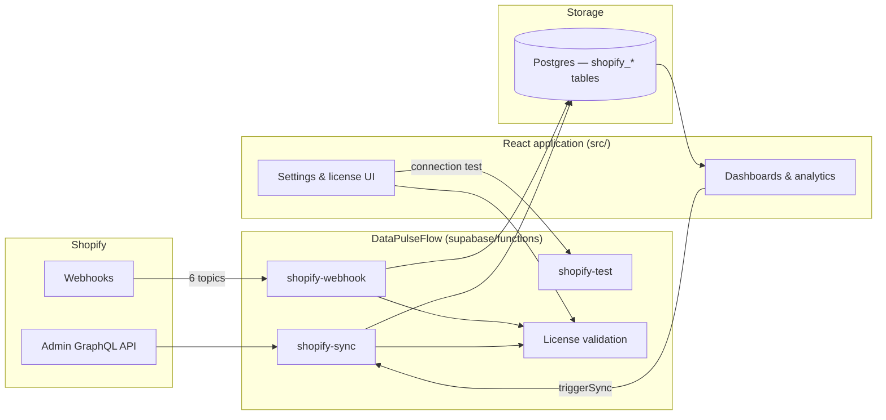

# Architecture

**Unique Distribution Sales Portal** is a React application built on top of **[DataPulseFlow](https://datapulseflow.com)** — the licensed Shopify data platform that powers all ingestion, schema, sync, and webhook processing for this system.

Without an active DataPulseFlow license and deployed sync layer, the application shell may load, but the **business system stops**: no live Shopify data, no webhook updates, and dashboards degrade to stale snapshots.

---

## System layers

| Layer | Owner | Responsibility |
|-------|-------|----------------|
| **Data platform** | DataPulseFlow | Shopify → Postgres ingestion, schema, webhooks, checkpoints, scheduled reconcile, license validation |
| **Application** | This repository | Auth, role-based dashboards, analytics UI, settings, team management |
| **Infrastructure** | Supabase | Postgres, Row Level Security, Edge Functions, Auth |

The `supabase/` directory in this repo is the **deployed DataPulseFlow integration** plus application-specific extensions (push notifications, analytics fact sync, admin utilities). The [`DataPulseFlow-integration-kit/`](../DataPulseFlow-integration-kit/) folder is the **vendor source-of-truth deliverable** from DataPulseFlow — not optional documentation.

---

## Data flow



**Canonical pipeline:**

```
Shopify → DataPulseFlow (webhook / sync) → Postgres → Analytics RPCs → Dashboard UI
```

Every revenue KPI, order row, customer assignment, and salesperson breakdown in the UI ultimately depends on tables populated exclusively by DataPulseFlow Edge Functions.

---

## DataPulseFlow components in this repo

### Edge Functions (required)

| Function | Role |
|----------|------|
| `shopify-webhook` | Real-time ingestion from Shopify (customers, orders, products create/update) |
| `shopify-sync` | Full and incremental sync via Admin GraphQL; checkpoint resume; optional cron |
| `shopify-test` | Pre-save Shopify credential validation |

All three depend on `_shared/` modules shipped as part of the DataPulseFlow integration (order upsert, salesperson matching, credential resolution, reporting fields, etc.).

### Database (required)

Migrations under `supabase/migrations/` define the DataPulseFlow schema:

- `shopify_customers`, `shopify_orders`, `shopify_order_items`, `shopify_products`, `shopify_variants`, `shopify_collections`
- `sync_logs`, `sync_checkpoints`, `shopify_webhook_events`
- `app_settings` (Shopify credentials + DataPulseFlow license keys)
- `salesperson_customer_assignments` and related RLS policies
- Optional `pg_cron` scheduled reconcile (calls `shopify-sync`)

A fresh deploy without these migrations cannot run the application meaningfully.

### License gate (required for live operation)

DataPulseFlow license settings in `app_settings`:

| Key | Purpose |
|-----|---------|
| `datapulse_access_code` | Access code from DataPulseFlow checkout |
| `datapulse_access_expires_at` | Expiry timestamp (renewable licenses) |
| `datapulse_license_mode` | `renewable` or `lifetime` |
| `datapulse_validation_url` | Remote validator endpoint (DataPulseFlow-hosted) |

`shopify-sync` and `shopify-webhook` call the validator on every request. The React app enforces the same rules before invoking sync. See [OPERATIONS.md](./OPERATIONS.md) for failure modes.

---

## Application layer (`src/`)

The frontend implements the contract described in [`DataPulseFlow-integration-kit/docs/FRONTEND-INTEGRATION.md`](../DataPulseFlow-integration-kit/docs/FRONTEND-INTEGRATION.md):

- **Settings** — Shopify credentials, sync frequency, DataPulseFlow license validation
- **`use-shopify-data.ts`** — PostgREST queries against `shopify_*` tables; `triggerSync()` invokes `shopify-sync`
- **Dashboards** — Admin, supervisor, manager, and salesperson views consume analytics RPCs built on DataPulseFlow-populated data

The UI does not talk to Shopify directly. All commerce data flows through DataPulseFlow.

---

## Deployment relationship

```
DataPulseFlow-integration-kit/     ← vendor deliverable (schema, functions, docs, license)
         │
         ▼ deployed + extended
supabase/                          ← live DataPulseFlow platform in this project
         │
         ▼ consumed by
src/                               ← application UI and business workflows
```

See also:

- [DEPENDENCIES.md](./DEPENDENCIES.md) — what breaks if each layer is removed
- [OPERATIONS.md](./OPERATIONS.md) — license renewal, sync lock, degradation behavior
- [`DataPulseFlow-integration-kit/docs/DEPLOYMENT.md`](../DataPulseFlow-integration-kit/docs/DEPLOYMENT.md) — Edge Function and migration deployment
- [`DataPulseFlow-integration-kit/docs/WEBHOOK-ENDPOINTS.md`](../DataPulseFlow-integration-kit/docs/WEBHOOK-ENDPOINTS.md) — canonical webhook URL and topics
